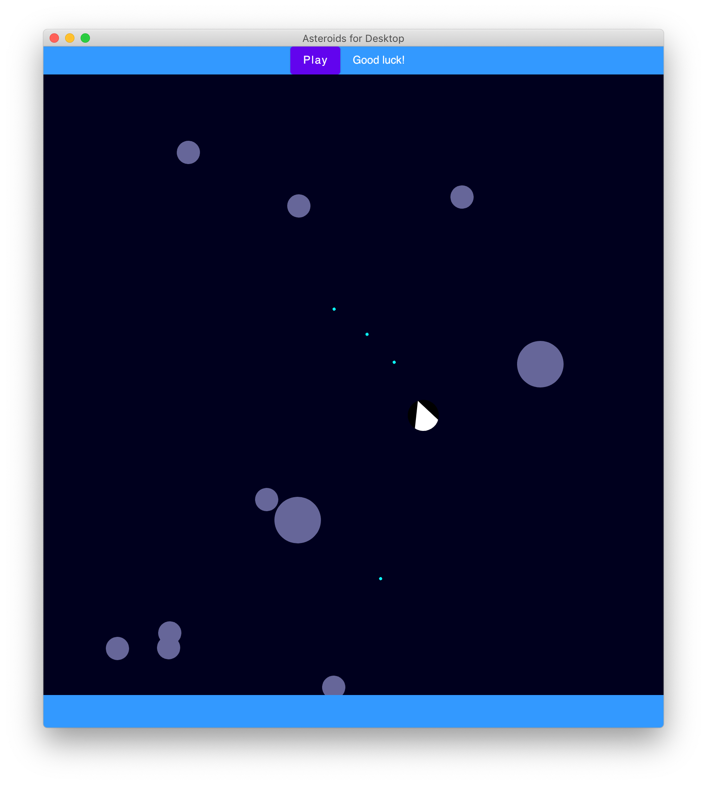

# Asteroids, built with Compose for Desktop

### Want to learn how I built it?
### Read the [two-part article](https://dev.to/kotlin/how-i-built-an-asteroids-game-using-jetpack-compose-for-desktop-309l) in which I describe the most interesting parts of this project.

`asteroids-compose-for-desktop` is a basic experiment of building a 2D space game on top of [Compose for Desktop](https://www.jetbrains.com/lp/compose/). 🚀 Run with `./gradlew run`. Feel free to explore, and enjoy! 🌕

